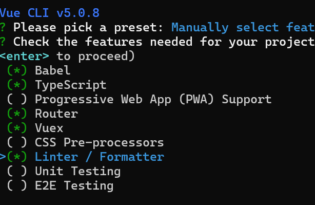
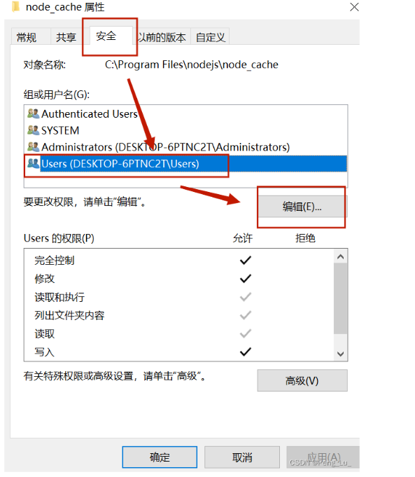
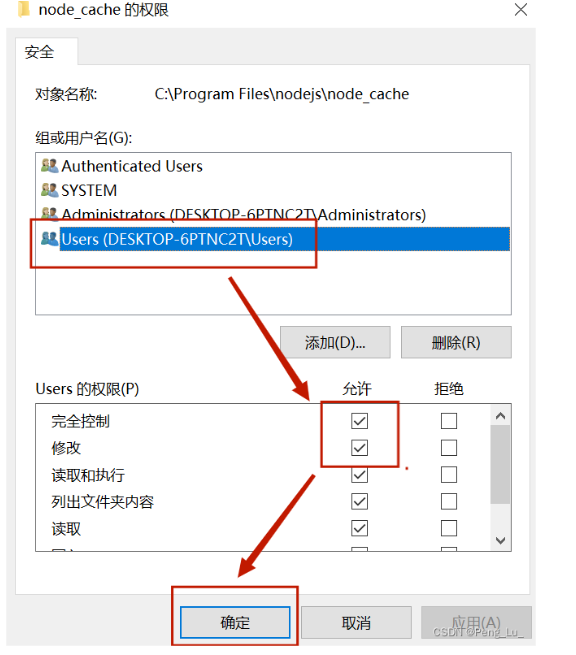
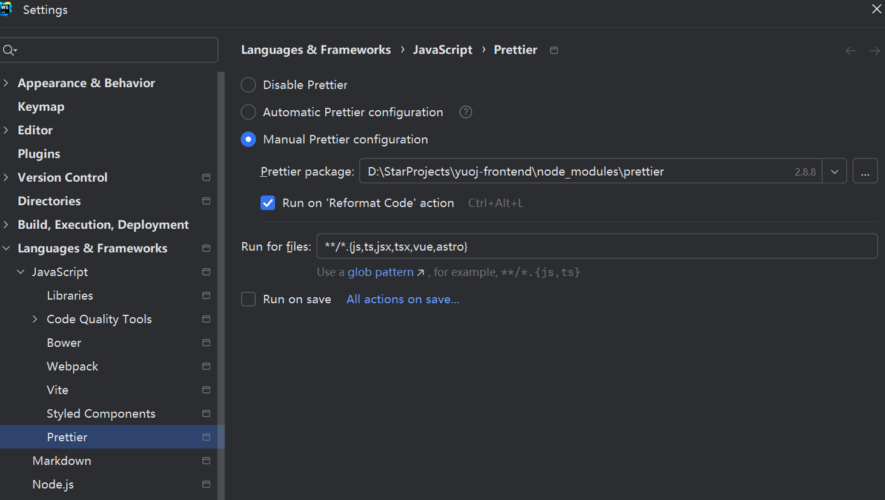
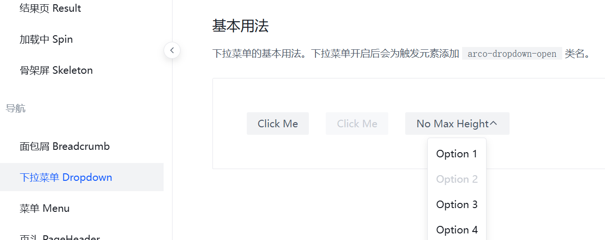

# yuoj-frontend

## Project setup
```
npm install
```

### Compiles and hot-reloads for development
```
npm run serve
```

### Compiles and minifies for production
```
npm run build
```

### Lints and fixes files
```
npm run lint
```

### Customize configuration
See [Configuration Reference](https://cli.vuejs.org/config/).


## 确认环境！！

### 初始化

使用 vue-cli 脚手架 https://cli.vuejs.org/zh/

检测是否安装过成功

`vue --version  或者 vue -V`


### 创建项目

选择，可以看官方文档 https://cli.vuejs.org/zh/guide/creating-a-project.html#vue-create




安装出错  `ERROR  Error: command failed: npm install --loglevel error --legacy-peer-deps`

解决方案，对 node_cache 和 node_global 进行修改






### 运行项目

先运行 package.json 的 serve

能运行就成功，也就是能进入 vue 前端页面


## 前端工程化配置

脚手架已经帮我们配置了代码美化、自动校验、格式化插件等，无需再自行配置




在 vue 文件中执行格式化快捷键 ctrl + alt + L，不报错，表示配置工程化成功

脚手架自动整合了 vue-router


### 引入组件

组件库：https://arco.design/vue

快速上手：https://arco.design/vue/docs/start

执行安装：`npm install --save-dev @arco-design/web-vue --legacy-peer-deps`

改变 main.js

```typescript
import { createApp } from "vue";
import App from "./App.vue";
import ArcoVue from "@arco-design/web-vue";
import "@arco-design/web-vue/dist/arco.css";
import router from "./router";
import store from "./store";

createApp(App).use(ArcoVue).use(store).use(router).mount("#app");
```

引入一个组件，如果加载成功就说明引入成功


## 项目布局

新建一个布局，在 BasicLayouts 中开发, 在 app.vue中引入

选用 arco design 的  layout 组件，先把上中下布局编排好，然后再填充内容


### 实现通用菜单

https://arco.design/vue/component/menu

把菜单上的路由改成读取路由文件，实现更通用的动态配置


1）提取通用路由文件

```typescript
import { RouteRecordRaw } from "vue-router";
import HomeView from "@/views/HomeView.vue";

export const routes: Array<RouteRecordRaw> = [
  {
    path: "/",
    name: "home",
    component: HomeView,
  },
  {
    path: "/about",
    name: "about",
    // route level code-splitting
    // this generates a separate chunk (about.[hash].js) for this route
    // which is lazy-loaded when the route is visited.
    component: () =>
      import(/* webpackChunkName: "about" */ "../views/AboutView.vue"),
  },
];
```

2）菜单组件读取路由，动态渲染菜单项

3）跳转到指定事件

```javascript
<a-menu
      mode="horizontal"
      :default-selected-keys="['1']"
      @menu-item-click="doMenuClick"
    >

const router = useRouter();

const doMenuClick = (key: string) => {
  router.push({
    path: key,
  });
};
```

4）同步路由到菜单项

更新页面后菜单还是会保持高亮

步骤：1、点击菜单项

​			2、跳转更新路由

​			3、更新路由后，同步去更新菜单栏的高亮状态

```typescript
const router = useRouter();

const selectedKeys = ref(["/"]);

// 路由跳转后，更新选中的菜单项
router.afterEach((to, from, failure) => {
  selectedKeys.value = [to.path];
});
```


### 全局状态管理

vuex ： https://vuex.vuejs.org/zh/guide/

直接跟着官方文档来

所有页面全局共享的变量，而不是局限在某一个页面中

适合作为全局状态的数据：已登录用户信息

本质上：给你提供了一套增删改查全局变量的 API，只不过可能多了一些功能（比如时间旅行）


state：存储用户状态信息

mutation（尽量同步）：定义了对变量增删改（更新）的方法

actions（支持异步）：执行异步操作，并且触发 mutation 的更改（actions 调用 mutation）

**提醒**：由于用户登录模块固定大小，而菜单不固定大小，可使用 Flex 布局


先定义 user 模块：

```typescript
// user.ts

// initial state
import { StoreOptions } from "vuex";

export default {
  namespaced: true,
  state: () => ({
    loginUser: {
      userName: "failure",
    },
  }),
  actions: {
    getLoginUser({ commit, state }, payload) {
      commit("updateUser", { userName: "Lantz" });
    },
  },
  mutations: {
    updateUser(state, payload) {
      state.loginUser = payload;
    },
  },
} as StoreOptions<any>;
```


```typescript
// index.ts

import { createStore } from "vuex";

export default createStore({
  state: {},
  getters: {},
  mutations: {},
  actions: {},
  modules: {},
});
```


获取状态变量：

```typescript
const store = useStore();
store.state.user?.loginUser // ？表示判断（三元表达式）
```


修改状态变量

```typescript
// GlobalHeader.vue
setTimeout(() => {
  store.dispatch("user/getLoginUser", {
    userName: "Lantz",
  });
});
```


#### 优化页面布局

1、底部 footer 布局优化

2、优化 content，globalHeader 的样式

3、优化导航栏用户名称的换行


## 权限管理

我能够直接以一套通用的机制，去定义哪个页面需要哪些权限


思路：

1、在路由配置文件，定义某个路由的访问权限

2、在全局页面组件中，绑定一个全局路由监听。每次访问页面时，根据用户要访问页面的路由信息，先判断用户是否有对应的访问权限

3、如果有，跳转到原页面；如果没有，拦截或跳转到 401 鉴权或登录页


### 设计隐藏菜单

1）routes.ts 给路由新增一个标志位，用户判断路由是否显隐

```typescript
{
  path: "/hide",
  name: "隐藏页面",
  component: HomeView,
  meta: {
    hideInMenu: true,
  },
},
```


2）不要用 v-for + v-if 去条件渲染元素，这样会先循环所有的元素，导致性能的浪费

推荐：先过滤只需要展示的元素数组

```typescript
// 显示在菜单的路由数组
const visibleRoutes = routes.filter((item, index) => {
  if (item.meta?.hideInMenu) {
    return false;
  }
  return true;
});
```


### 根据权限隐藏菜单

需求：只有具有权限的菜单，才对用户可见

原理：类似上面的控制路由显示隐藏，只要判断用户没有这个权限，就直接过滤掉


### 全局权限

1）定义权限

```typescript
/**
 * 权限定义
 */
const ACCESS_ENUM = {
  NOT_LOGIN: "notLogin",
  USER: "user",
  ADMIN: "admin",
};

export default ACCESS_ENUM;
```


2）定义一个公用的权限校验方法

为什么？因为菜单组件中要判断权限、权限拦截也要用到权限判断功能，所以抽离成公共方法

创建 checkAccess.ts 文件，专门定义检测权限的函数：

```typescript
import ACCESS_ENUM from "@/access/accessEnum";

/**
 * 检查权限（判断当前登录用户是否具有某个权限）
 * @param loginUser 当前登录用户
 * @param needAccess 需要有的权限
 * @return boolean 有无权限
 */
const checkAccess = (loginUser: any, needAccess = ACCESS_ENUM.NOT_LOGIN) => {
  // 获取当前登录用户具有的权限（如果没有 loginUser，则表示未登录）
  const loginUserAccess = loginUser?.userRole ?? ACCESS_ENUM.NOT_LOGIN;
  if (needAccess === ACCESS_ENUM.NOT_LOGIN) {
    return true;
  }
  // 如果用户登录才能访问
  if (needAccess === ACCESS_ENUM.USER) {
    // 如果用户没有登录，那么表示没权限
    if (loginUserAccess === ACCESS_ENUM.NOT_LOGIN) {
      return false;
    }
  }
  // 如果需要管理员权限
  if (needAccess === ACCESS_ENUM.ADMIN) {
    // 如果不为管理员，表示无权限
    if (loginUserAccess !== ACCESS_ENUM.ADMIN) {
      return false;
    }
  }
  return true;
};
export default checkAccess;

```


3）修改 GlobalHeader 动态菜单组件，根据权限来过滤菜单

注意：这里使用的是计算属性（computed)，是为了当登录用户信息发生变更时，触发菜单栏的重新渲染，展示新增权限的菜单项


```typescript
// 显示在菜单的路由数组
const visibleRoutes = computed(() => {
  return routes.filter((item, index) => {
    if (item.meta?.hideInMenu) {
      return false;
    }
    // 根据权限过滤菜单
    if (!checkAccess(loginUser, item?.meta?.access as string)) {
      return false;
    }
    return true;
  });
});
```


### 全局项目入口

app.vue  中预留一个可以编写全局初始化逻辑的代码

```typescript
/**
 * 全局初始化函数，有全局单词调用的代码，都可以写到这里
 */
const doInit = () => {
  console.log("hello 欢迎来到我的项目");
};
onMounted(() => {
  doInit();
});
```


## 前后端联调

Q：前端和后端怎么连接起来的？接口 / 请求

A：前端发送请求调用后端接口


1）安装请求工具类 Axios

官方文档：https://axios-http.com/docs/intro

代码：`npm install axios`


2）编写调用后端的代码

传统情况下，每个请求都要单独编写代码。至少得写一个请求路径

完全不需要！

直接自动生成：https://github.com/ferdikoomen/openapi-typescript-codegen

首先安装

`npm install openapi-typescript-codegen --save-dev`

然后执行命令生成代码：

```shell
openapi --input http://localhost:8121/api/v2/api-docs --output ./generated --client axios
```


3）直接使用生成的 Service 代码，直接调用函数发送请求即可，比如获取登录信息

```typescript
// 远程获取登录信息
const res = await UserControllerService.getLoginUserUsingGet();
if (res.code === 0) {
  commit("updateUser", res.data);
} else {
  commit("updateUser", {
    ...state.loginUser,
    userRole: ACCESS_ENUM.NOT_LOGIN,
  });
}
```


如果想要自定义请求参数，怎么办？

1）使用代码生成器提供的全局参数修改对象：

```typescript
export const OpenAPI: OpenAPIConfig = {
    BASE: 'http://localhost:8121',
    VERSION: '1.0',
    WITH_CREDENTIALS: false,
    CREDENTIALS: 'include',
    TOKEN: undefined,
    USERNAME: undefined,
    PASSWORD: undefined,
    HEADERS: undefined,
    ENCODE_PATH: undefined,
};
```

文档：https://github.com/ferdikoomen/openapi-typescript-codegen/wiki/OpenAPI-object


2）直接定义 axios 请求库的全局参数，比如全局请求响应拦截器

`https://github.com/ferdikoomen/openapi-typescript-codegen/wiki/OpenAPI-object`

文档：https://axios-http.com/docs/interceptors

示例代码： 

```typescript
// Add a request interceptor
import axios from "axios";

axios.interceptors.request.use(
  function (config) {
    // Do something before request is sent
    return config;
  },
  function (error) {
    // Do something with request error
    return Promise.reject(error);
  }
);

// Add a response interceptor
axios.interceptors.response.use(
  function (response) {
    console.log("响应", response);
    // Any status code that lie within the range of 2xx cause this function to trigger
    // Do something with response data
    return response;
  },
  function (error) {
    // Any status codes that falls outside the range of 2xx cause this function to trigger
    // Do something with response error
    return Promise.reject(error);
  }
);
```


## 用户登录功能

### 自动登录

1）在 store\user.ts 编写获取远程登录用户信息的代码：

```typescript
actions: {
  async getLoginUser({ commit, state }, payload) {
    // 远程获取登录信息
    const res = await UserControllerService.getLoginUserUsingGet();
    if (res.code === 0) {
      commit("updateUser", res.data);
    } else {
      commit("updateUser", {
        ...state.loginUser,
        userRole: ACCESS_ENUM.NOT_LOGIN,
      });
    }
  },
},
```


2）在哪里去触发 getLoginUser 函数的执行？ 应当在一个全局的位置

有很多选择：

1. 路由拦截
2. 全局页面入口 app.vue
3. 全局通用布局（所有页面都共享的组件）


## 全局权限管理优化

1）新建 access\index.ts 文件，把原有的路由拦截、权限校验逻辑放在独立的文件中

优势：只要不引入、就不会开启、不会对项目有影响

如果没有登陆过，就自动登录

```typescript
const loginUser = store.state.user.loginUser;
// 如果之前没有登陆过，自动登录
if (!loginUser || !loginUser.userRole) {
  await store.dispatch("user/getLoginUser");
}
```


如果用户访问的页面不需要登陆，是否需要强制跳转到登录页？

答：不需要

access/index.ts 示例代码：

```typescript
import router from "@/router";
import store from "@/store";
import ACCESS_ENUM from "@/access/accessEnum";
import checkAccess from "@/access/CheckAccess";

router.beforeEach(async (to, from, next) => {
  console.log("登陆用户信息", store.state.user.loginUser);

  const loginUser = store.state.user.loginUser;
  // 如果之前没有登陆过，自动登录
  if (!loginUser || !loginUser.userRole) {
    // 加 await 是为了等用户登录成功之后，再执行后续的代码
    await store.dispatch("user/getLoginUser");
  }

  const needAccess = to.meta?.access ?? ACCESS_ENUM.NOT_LOGIN;
  // 要跳转的页面不需要登录
  if (needAccess === ACCESS_ENUM.NOT_LOGIN) {
    // 如果没登陆，直接继续执行
    if (!loginUser) {
      next(`/user/login?redirectUrl=${to.fullPath}`);
      return;
    }
    // 如果已经登陆了，但是权限不足，那么跳转到无权限页面
    if (!checkAccess(loginUser, needAccess)) {
      next("/noAuth");
      return;
    }
  }
  next();
});
```


### 支持多套布局

1）在 routes 路由文件中新建一套用户路由，使用 vue-router 自带的子路由机制，实现布局和嵌套路由

```typescript
export const routes: Array<RouteRecordRaw> = [
  {
    path: "/suer",
    name: "用户",
    component: UserLayout,
    children: [
      {
        path: "/user/login",
        name: "用户登录",
        component: UserLoginView,
      },
      {
        path: "/user/register",
        name: "用户注册",
        component: UserRegisterView,
      },
    ],
  },
]
```


2）新建 UserLayout，UserLoginView，UserRegisterView 页面，并且在 routes 中引入

3）在 app.vue 根页面文件，根据路由去区分多套布局

```typescript
<template v-if="route.path.startsWith('/user')">
      <router-view />
    </template>
    <template v-else>
      <BasicLayouts />
    </template>
```

当前这种 app.vue 中通过 if else 区分布局的方式，不是最优雅的，理想情况下是直接读取 routes.ts，在这个文件中定义多套布局，然后自动使用页面布局


> 扩展：尝试实现上面思路，并且根据嵌套路由生成嵌套的子菜单，如图



> 扩展：优化头像组件，可以点击查看个人信息


## 开发前端

以开发前端页面为主


1）用户注册页面

2）建题目页面（管理员）

3）题目管理页面（管理员）

- 查看（搜索）
- 删除
- 修改
- 快捷创建

4）题目列表页（用户）

5）题目详情页（在线做题页）

- 判题状态的查看

6）题目提交列表页 


> 扩展：提交统计页，用户个人页

### 接入要用到的组件

先接入可能用到的组件，再去写页面，避免因为后续依赖冲突，整合组件失败带来的返工

#### Markdown 编译器

为什么用Markdown？

一套通用的文本编辑语法，可以在各大网站上统一标准，渲染出统一的样式，比较简单易学

推荐的 Md 编辑器：https://github.com/pd4d10/bytemd

阅读官方文档，下载编辑器主题、以及 gfm（表格支持）插件、highlight 代码高亮插件

```typescript
npm i @bytemd/vue-next
npm i @bytemd/plugin-gfm @bytemd/plugin-highlight
```


新建 MdEditor 组件，编写代码

```vue
<template>
  <div class="home">
    <MdEditor />
    
    <HelloWorld msg="Welcome to Your Vue.js + TypeScript App" />
  </div>
</template>

<script lang="ts">
import { defineComponent } from "vue";
import HelloWorld from "@/components/HelloWorld.vue";
import MdEditor from "@/components/MdEditor.vue"; // @ is an alias to /src

export default defineComponent({
  name: "HomeView",
  components: {
    MdEditor,
    HelloWorld,
  },
});
</script>
```


隐藏编辑器中不需要的操作图标（比如 GitHub 的图标）：

```css
.bytemd-toolbar-icon.bytemd-tippy.bytemd-tippy-right:last-child svg {
    display: none;
}
```


要把 MdEditor 当前输入的值暴露给父组件，便于父组件去使用，同时也是提高组件的通用性，需要定义属性，把 value 和 handleChange 事件交给父组件去管理：

MdEditor 示例代码：

```typescript
/**
 * 定义组件属性的类型
 */
interface Props {
  value: string;
  handleChange: (v: string) => void;
}
/**
 * 给组件指定固定值
 */
const props = withDefaults(defineProps<Props>(), {
  value: () => "",
  handleChange: (v: string) => {
    console.log(v);
  },
});

```


#### 代码编译器

微软官方 Editor：https://github.com/microsoft/monaco-editor

官方提供的整合教程：https://github.com/microsoft/monaco-editor/blob/main/docs/integrate-esm.md

安装：

1）` npm install monaco-editor`

2）vue-cli 项目（webpack 项目）整合 Monaco editor：

先安装 monaco-editor-webpack-plugin（ https://github.com/microsoft/monaco-editor/blob/main/webpack-plugin/README.md）：

`npm install monaco-editor-webpack-plugin`


在 vue.config.js 中配置 webpack 插件：

全量加载

```typescript
const { defineConfig } = require("@vue/cli-service");
const MonacoWebpackPlugin = require("monaco-editor-webpack-plugin");
module.exports = defineConfig({
  transpileDependencies: true,
  chainWebpack(config) {
    config.plugin(new MonacoWebpackPlugin({}));
  },
});
```

按需加载：

```js
const MonacoWebpackPlugin = require('monaco-editor-webpack-plugin')
module.exports = {
  chainWebpack: config => {
    config.plugin('monaco-editor').use(MonacoWebpackPlugin, [
      {
        // Languages are loaded on demand at runtime
        languages: ['json', 'go', 'css', 'html', 'java', 'javascript', 'less', 'markdown', 'mysql', 'php', 'python', 'scss', 'shell', 'redis', 'sql', 'typescript', 'xml'], // ['abap', 'apex', 'azcli', 'bat', 'cameligo', 'clojure', 'coffee', 'cpp', 'csharp', 'csp', 'css', 'dart', 'dockerfile', 'ecl', 'fsharp', 'go', 'graphql', 'handlebars', 'hcl', 'html', 'ini', 'java', 'javascript', 'json', 'julia', 'kotlin', 'less', 'lexon', 'lua', 'm3', 'markdown', 'mips', 'msdax', 'mysql', 'objective-c', 'pascal', 'pascaligo', 'perl', 'pgsql', 'php', 'postiats', 'powerquery', 'powershell', 'pug', 'python', 'r', 'razor', 'redis', 'redshift', 'restructuredtext', 'ruby', 'rust', 'sb', 'scala', 'scheme', 'scss', 'shell', 'solidity', 'sophia', 'sql', 'st', 'swift', 'systemverilog', 'tcl', 'twig', 'typescript', 'vb', 'xml', 'yaml'],

        features: ['format', 'find', 'contextmenu', 'gotoError', 'gotoLine', 'gotoSymbol', 'hover' , 'documentSymbols'] //['accessibilityHelp', 'anchorSelect', 'bracketMatching', 'caretOperations', 'clipboard', 'codeAction', 'codelens', 'colorPicker', 'comment', 'contextmenu', 'coreCommands', 'cursorUndo', 'dnd', 'documentSymbols', 'find', 'folding', 'fontZoom', 'format', 'gotoError', 'gotoLine', 'gotoSymbol', 'hover', 'iPadShowKeyboard', 'inPlaceReplace', 'indentation', 'inlineHints', 'inspectTokens', 'linesOperations', 'linkedEditing', 'links', 'multicursor', 'parameterHints', 'quickCommand', 'quickHelp', 'quickOutline', 'referenceSearch', 'rename', 'smartSelect', 'snippets', 'suggest', 'toggleHighContrast', 'toggleTabFocusMode', 'transpose', 'unusualLineTerminators', 'viewportSemanticTokens', 'wordHighlighter', 'wordOperations', 'wordPartOperations']
      }
    ])
  }
}
```


如何使用 monaco editor? 查看示例教程：

https://microsoft.github.io/monaco-editor/playground.html?source=v0.52.2#example-creating-the-editor-hello-world


整合教程参考：https://zhenglinglu.cn/pages/e488ab/#%E5%9C%A8-vue-%E4%B8%AD%E4%BD%BF%E7%94%A8


注意，monaco editor 在读写值的时候，要使用 toRaw（编辑器实例）的语法来执行操作，否则会卡死。示例整合代码如下：

```vue
<template>
  <div id="code-editor" ref="codeEditorRef" style="min-height: 400px" />
  <!--  <a-button @click="fillValue">填充值</a-button>-->
</template>

<script setup lang="ts">
import * as monaco from "monaco-editor";
import { onMounted, ref, toRaw, withDefaults, defineProps } from "vue";

/**
 * 定义组件属性的类型
 */
interface Props {
  value: string;
  handleChange: (v: string) => void;
}

/**
 * 给组件指定固定值
 */
const props = withDefaults(defineProps<Props>(), {
  value: () => "",
  handleChange: (v: string) => {
    console.log(v);
  },
});

const codeEditorRef = ref();
const codeEditor = ref();

const fillValue = () => {
  if (!codeEditor.value) {
    return;
  }
  // 改变值
  toRaw(codeEditor.value).setValue("新的值");
};

onMounted(() => {
  if (!codeEditorRef.value) {
    return;
  }
  // Hover on each property to see its docs!
  codeEditor.value = monaco.editor.create(codeEditorRef.value, {
    value: props.value,
    language: "java",
    automaticLayout: true,
    colorDecorators: true, // 颜色装饰器
    minimap: {
      enabled: true,
    },
    readOnly: false,
    theme: "vs-dark",
  });

  // 编辑 监听内容变化
  codeEditor.value.onDidChangeModelContent(() => {
    props.handleChange(toRaw(codeEditor.value).getValue());
  });
});
</script>

<style scoped></style>
```


同 Md编辑器一样，也要接受父组件的传值，把显示的输入交给父组件去控制，从而能够让父组件实时得到用户输入的代码

```typescript
/**
 * 定义组件属性的类型
 */
interface Props {
  value: string;
  handleChange: (v: string) => void;
}

/**
 * 给组件指定固定值
 */
const props = withDefaults(defineProps<Props>(), {
  value: () => "",
  handleChange: (v: string) => {
    console.log(v);
  },
});
```


> 项目扩展：用 diff editor 对比用户代码和标准答案


## 页面开发

### 创建题目页面

重新根据后端生成前端请求代码：

`openapi --input http://localhost:8121/api/v2/api-docs --output ./generated --client axios`

需要用户输入的值：

```json
{
  "answer": "abc",
  "content": "题目内容",
  "judgeCase": [
    {
      "input": "1 2",
      "output": "3 4"
    }
  ],
  "judgeConfig": {
    "memoryLimit": 1000,
    "stackLimit": 1000,
    "timeLimit": 1000
  },
  "tags": [
        "栈", "简单", "数学"   
],
  "title": "B + C"
}
```

### 小知识 - 自定义代码模板

在 Jet Brains 系列编辑器中打开设置，搜索 live Template，先创建一个自定义模板组，在组下创建代码模板。效果：输入缩写，即可生成模板代码。

```vue
<template>
  <div id="$ID$"></div>
</template>

<script setup lang="ts"></script>
$END$
<style scoped>
#$ID$ {
}
</style>

```


使用表单组件，先复制示例代码，再修改：https://arco.design/vue/component/form

此处我们用到了

- 嵌套表单：https://arco.design/vue/component/form#nest
- 动态增减表单：https://arco.design/vue/component/form#dynamic


注意，我们自定义的代码编辑器组件不会被组件库识别，需要手动指定 value 和 handleChange 函数


## 前端页面开发

### 当前代码优化

#### 1）先处理菜单项的权限控制和显示隐藏

通过 meta.hideInMenu 和 meta.access 属性控制


#### 2）管理页面分页问题的修复

可以参考聚合搜索项目的搜索条件改变和 url 状态同步

核心原理：在分页页号改变时，触发 @page-change 事件，通过改变 searchParams 的值，并且通过 watchEffect 监听 searchParams 的改变（然后执行 loadData 重新加载速度），实现了页号变化时的触发数据的重新加载

#### 3）修复刷新页面未登录问题

修改 access\index.ts 中的获取登陆用户信息，把登录后的信息更新到 loginUser 变量上

```typescript
// 如果之前没有登陆过，自动登录
if (!loginUser || !loginUser.userRole) {
  // 加 await 是为了等用户登录成功之后，再执行后续的代码
  await store.dispatch("user/getLoginUser");
  loginUser = store.state.user.loginUser;
}
```


## 题目管理页面开发

1）使用表格组件：https://arco.design/vue/component/table#custom （需要找到自定义操作的示例）

2）查询数据

3）定义表格列

4）加载数据

5）调整格式

比如 json 格式不好看，有 2 种方法调整：

```
1. 使用组件库自带的语法，自动格式化（更方便）
```

2. 完全自定义渲染，想展示什么就展示什么（更灵活）

6）添加删除、更新操作

删除后要执行 loadData 刷新数据


### 更新页面开发

策略：由于更新和创建都是相同的表单，所以完全没必要开发 / 复制 2 遍，可以直接复用创建页面

关键实现：如何区分两个页面？

```
1. 路由（/add/question 和 /update/question）
```

2. 请求参数（id = 1)


更新页面相比于创建页面，多了 2 个改动：

1. 在加载页面时，更新页面需要加载出之前的数据
2. 在提交时，请求的地址不同


## 题目列表搜索页

核心实现： 表格组件


1）复制管理题目页的表格

2）只保留需要的 columns 字段

3）自定义表格列的渲染

标签：使用 tag 组件

通过率：自行计算

创建时间：使用 moment 库进行格式化（https://momentjs.com/docs/#/displaying/format/）

操作按钮：补充跳转到做题页的按钮

4）编写搜索表单，使用 form 的 layout = inline 布局，让用户的输入和 searchParams 同步，并且给提交按钮绑定修改 searchParams ，从而被 watchEffect 监听，触发查询


### 标签返回 json 样式是字符串

问题：


解决方案：listQuestionByPageUsingPost() 改为 listQuestionVoByPageUsingPost()

```typescript
const loadData = async () => {
  const res = await QuestionControllerService.listQuestionVoByPageUsingPost(
    searchParams.value
  );
  if (res.code === 0) {
    dataList.value = res.data.records;
    total.value = res.data.total;
  } else {
    message.error("加载失败" + res.message);
  }
};
```


